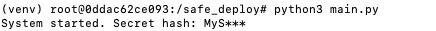
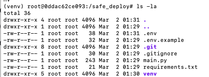

# Домашнее задание №3 "Hello, Production!"

# 1. Ссылка на репозиторий

[Ссылка на репозиторий](https://github.com/VikaKormashova/safe_deploy)

# 2. Скриншот команды python3 main.py

# 3. Скриншот команды ls -la

